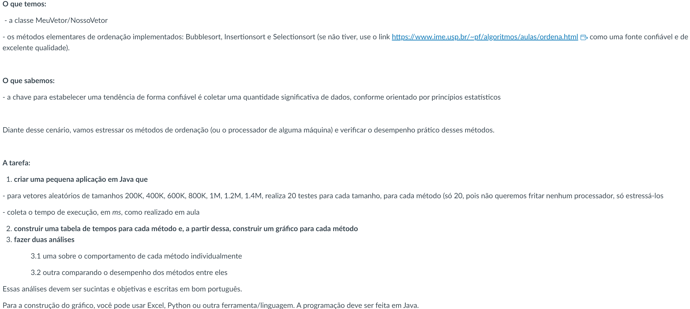

# T1 - Estrutura de Dados

# O que deverá ser feito? <picture><source srcset="https://fonts.gstatic.com/s/e/notoemoji/latest/1f914/512.webp" type="image/webp"></picture>

## Documento da Professora Machion 📃

# Colaboradores 🤝

<table>
  <tr>
    <td align="center">
      <a href="#">
         
        
          
<b><i>Alessandro Lima:</i></b> <a href="https://github.com/alexZ7000"><i>alexZ7000</i></a> RA: 23.01172-6

        
      </a>
    </td>
    <td align="center">
      <a href="#">
         
        
          
<b><i>Breno Coutinho:</i></b> <a href="https://github.com/Breno1101"><i>Breno1102</i></a> RA: 23.01297-8

        
      </a>
    </td>
    <td align="center">
      <a href="#">
         
        
          
<b><i>Luca Pinheiro:</i></b> <a href="https://github.com/LucaPinheiro"><i>Luca Pinheiro</i></a> RA: 23.00335-9

        
      </a>
    </td>
    <td align="center">
      <a href="#">
         
        
          
<b><i>Marcelo Zoletti:</i></b> <a href="https://github.com/ZettDev"><i>ZettDev</i></a> RA: 23.00171-2

        
      </a>
    </td>
  </tr>
</table>